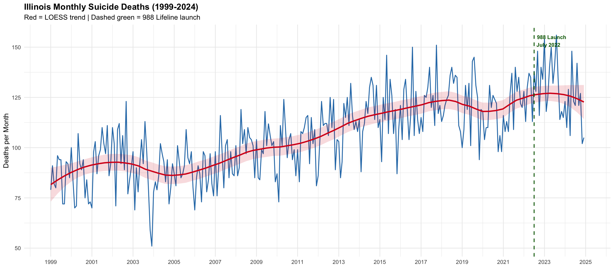
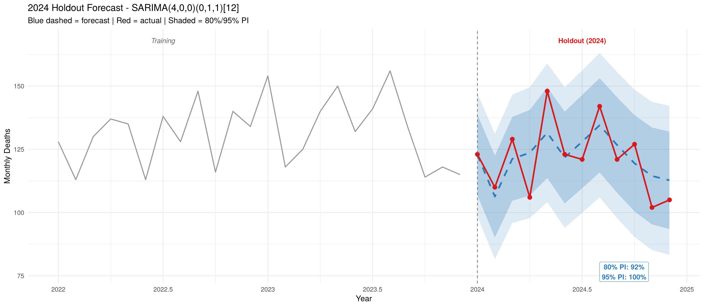

# Forecasting Monthly Suicide Deaths in Illinois

Statewide monthly forecasts of suicide deaths in Illinois, built to help crisis lines and public health teams plan staffing ahead of seasonal peaks. The forecasts are aggregate counts for planning. They say nothing about risk for any individual.

Team project for Time Series Analysis and Forecasting (ADSP 31006), MS in Applied Data Science, University of Chicago, Winter 2026.

## Question

Can monthly suicide deaths in Illinois be forecast well enough, with usable prediction intervals, to support staffing decisions made months ahead?

## Data

- Source: CDC WONDER. *Multiple Cause of Death, 1999-2020* for 1999 to 2020, and *Provisional Mortality Statistics, 2018 through Last Week* for 2021 to 2024. Both were queried on February 13, 2026.
- Illinois residents, grouped by month, with the underlying cause of death coded as intentional self-harm (ICD-10 X60-X84, Y87.0). See Limitations for two extra codes in the query.
- 312 months from January 1999 to December 2024, with 33,227 deaths. Monthly counts range from 51 to 156.
- The two sources match exactly for the 36 months they share (2018 to 2020).
- The provisional database uses CDC's final files for 2018 to 2023, so only the 2024 counts in the analysis were still provisional at the query date.

## Approach

- Train on 1999 to 2023 (300 months) and hold out 2024 (12 months).
- Compare five models: a seasonal naive baseline, Poisson and negative binomial regression with a linear trend and month effects, damped multiplicative Holt-Winters, and SARIMA.
- Test the fitted models' residuals for autocorrelation (Ljung-Box). For the selected model, check prediction interval coverage on 2024 and run walk-forward cross-validation on the training period.

## Results

2024 holdout:

| Model | RMSE | MAPE | Ljung-Box p | AICc |
| --- | ---: | ---: | ---: | ---: |
| Seasonal naive (baseline) | 17.25 | 12.41% | | |
| Poisson regression | 15.71 | 11.62% | 1.1e-08 | 2354.31 |
| Negative binomial regression | 15.69 | 11.60% | 1.1e-08 | 2349.51 |
| Damped Holt-Winters (multiplicative) | 13.17 | 9.30% | 0.60 | 3213.43 |
| SARIMA(4,0,0)(0,1,1)[12] | 9.43 | 6.64% | 0.25 | 2291.14 |

AICc is only comparable within a model family, so the choice rests on holdout error and residual checks. As in the notebook, Ljung-Box uses lag 12 for the regression models and lag 24 for Holt-Winters and SARIMA. At lag 12, SARIMA's residuals also fail the test (p = 0.008), so some short-range autocorrelation remains.

- SARIMA cut RMSE by 45% and MAPE by 47% against the seasonal naive baseline.
- The regression models left autocorrelation in their residuals (Ljung-Box p about 1e-8).
- 2024 was an easier year than average. Walk-forward cross-validation on 1999 to 2023 (expanding window, one month ahead, refit at each step, 282 forecasts) gave SARIMA an RMSE of 13.55 and a MAPE of 10.44%.
- In 2024, 11 of 12 months fell inside SARIMA's 80% interval and all 12 fell inside its 95% interval.

## From forecast to staffing

The final presentation proposed planning peak-month capacity to the top of the 95% interval. For August 2024 that was 163 deaths, against a point forecast of 135 and an actual count of 142. Turning deaths into crisis line demand requires operating assumptions that this project does not estimate.

## Limitations

- Monthly data only, so the model cannot warn of changes a few weeks ahead.
- One holdout year. The walk-forward numbers are a better guide to typical one-month-ahead error.
- The 2024 counts were provisional when queried and may change slightly.
- The CDC WONDER queries also included ICD-10 Y87.1 (sequelae of assault) and Y87.2 (sequelae of events of undetermined intent), which are not suicide codes. The series will be rebuilt without them to measure the effect.
- Statewide totals only. Any breakdown by county, age or sex would have to suppress counts of 1 to 9 under CDC WONDER's data use rules.

## Team and my role

Authors: Payton Stewart, Adaora Ezike, Eduardo Tovilla Rivera, Hoon Yum.

I was the project lead. The topic came from my proposal, and I set up the team's GitHub repository. Teammates and I wrote the analysis code in parallel, and I worked on all five models before we merged the final notebook. I also designed the structure of the final presentation.

The team's working repository is [Forecasting-Suicide-Mortality/illinois-suicide-early-warning](https://github.com/Forecasting-Suicide-Mortality/illinois-suicide-early-warning). Its README is from the proposal stage; this README reports the final results.

## Next steps

- Rebuild the series without Y87.1 and Y87.2, using the latest CDC data.
- Backtest all five models at 1 to 12 month horizons and check interval coverage at each horizon.
- Score the model against 2025 data, which was not complete when the project was done.

## Repository

- `notebook/Illinois_Suicide_Mortality_Forecasting_final.ipynb`: the full analysis in R, with outputs. If GitHub does not render it, open it on [nbviewer](https://nbviewer.org/github/jhoonyum/Forecasting-Suicide-Mortality/blob/main/notebook/Illinois_Suicide_Mortality_Forecasting_final.ipynb).
- `notebook/*.csv`: the two CDC WONDER exports the notebook reads, with CDC's notes and query parameters at the end of each file. The provisional file also contains rows for January 2025 to February 2026, which the analysis does not use. Counts from August 2025 on were incomplete at the query date (0 from September 2025 on).
- `figures/`: charts exported from the notebook.

To rerun, open the notebook from the `notebook/` folder in Jupyter with an R kernel and the packages loaded in its first cell (dplyr, readr, lubridate, zoo, forecast, tseries, MASS, ggplot2, scales).

## Data source and use

- Centers for Disease Control and Prevention, National Center for Health Statistics. National Vital Statistics System, Mortality 1999-2020 on CDC WONDER Online Database, released in 2021. Data are from the Multiple Cause of Death Files, 1999-2020, as compiled from data provided by the 57 vital statistics jurisdictions through the Vital Statistics Cooperative Program. Accessed at http://wonder.cdc.gov/mcd-icd10.html on February 13, 2026.
- Centers for Disease Control and Prevention, National Center for Health Statistics. National Vital Statistics System, Provisional Mortality on CDC WONDER Online Database. Data are from the final Multiple Cause of Death Files, 2018-2023, and from provisional data for years 2024 and later, as compiled from data provided by the 57 vital statistics jurisdictions through the Vital Statistics Cooperative Program. Accessed at http://wonder.cdc.gov/mcd-icd10-provisional.html on February 13, 2026.

The data are used for statistical analysis only, as CDC WONDER's data use restrictions require.

## Support

If you or someone you know is struggling, call or text 988 (Suicide and Crisis Lifeline) or chat at 988lifeline.org.
